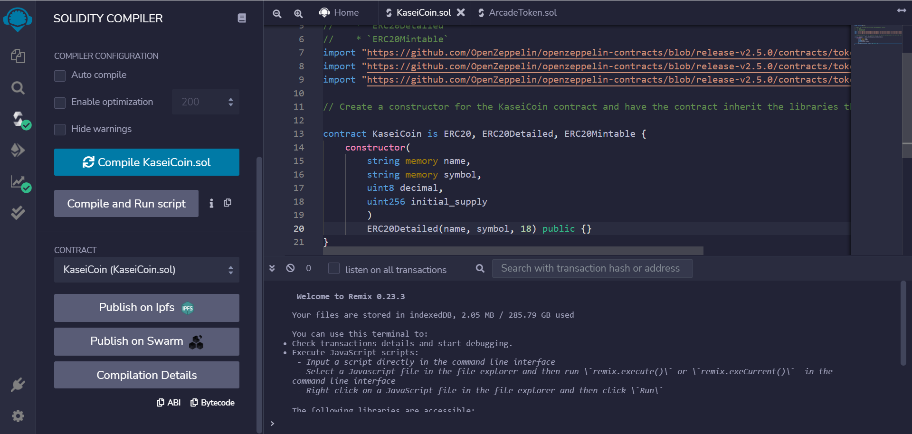
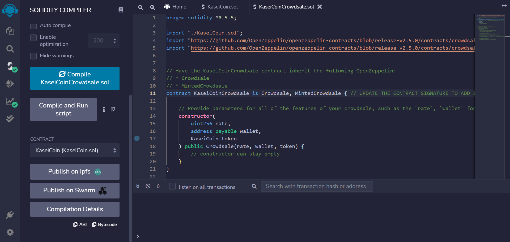
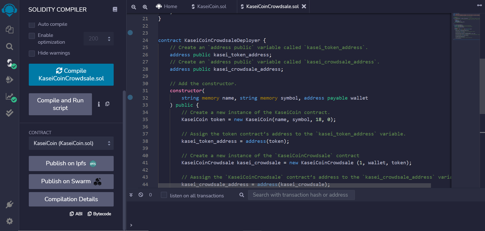

# Challenge21

## Introduction

You will create a fungible token that is ERC-20 compliant and that will be minted by using a `Crowdsale` contract from the OpenZeppelin Solidity library.

The crowdsale contract that you create will manage the entire crowdsale process, allowing users to send ether to the contract and in return receive KAI, or KaseiCoin tokens. Your contract will mint the tokens automatically and distribute them to buyers in one transaction.

## Instructions

Upload the files `KaseiCoinCrowdsale.sol` and `KaseiCoin.sol` on https://remix.ethereum.org/.
Fill the missing parts, test the functionality on a personal Ethereum blockchain on Ganache by means of Metamask and record a video.

## Evaluation Evidence

### 1. Create the KaseiCoin token contract

### 2. Create the KaseiCoin crowdsale contract

### 3. Create the KaseiCoin crowdsale deployer contract

### 4. Deploy the contract on a local blockchain

https://user-images.githubusercontent.com/86806855/169716476-2be342eb-204d-41ec-bfce-908e1cdcb13b.mp4

## License

Copyright 2022 Antonio Parolini

Permission is hereby granted, free of charge, to any person obtaining a copy of this software and associated documentation files (the "Software"), to deal in the Software without restriction, including without limitation the rights to use, copy, modify, merge, publish, distribute, sublicense, and/or sell copies of the Software, and to permit persons to whom the Software is furnished to do so, subject to the following conditions:

The above copyright notice and this permission notice shall be included in all copies or substantial portions of the Software.

THE SOFTWARE IS PROVIDED "AS IS", WITHOUT WARRANTY OF ANY KIND, EXPRESS OR IMPLIED, INCLUDING BUT NOT LIMITED TO THE WARRANTIES OF MERCHANTABILITY, FITNESS FOR A PARTICULAR PURPOSE AND NONINFRINGEMENT. IN NO EVENT SHALL THE AUTHORS OR COPYRIGHT HOLDERS BE LIABLE FOR ANY CLAIM, DAMAGES OR OTHER LIABILITY, WHETHER IN AN ACTION OF CONTRACT, TORT OR OTHERWISE, ARISING FROM, OUT OF OR IN CONNECTION WITH THE SOFTWARE OR THE USE OR OTHER DEALINGS IN THE SOFTWARE.